# A Study of Deep Learning Based Generative Models: VAE vs GAN

Shanlong Guo

University of Florida

sh.guo@ufl.edu

All code for this report has been uploaded to Github: https://github.com/TerryGSL/MLProject.git

## Abstract

In this project report, I mainly learn the basic principles of two major generative models GAN and VAE, and use them to generate some new images, the main dataset used is mnist, from the comparison of the generated results I found that the images generated by VAE are more blurred, while the images generated by GAN are realistic, but its potential space may not have good structure.

Since the images generated using GAN are more noisy, I also studied a variant model of GAN, DCGAN, which optimizes the network structure based on GAN and makes the network easier to train. I first used it to generate some new mnist handwritten digital images and found that the generated images are of higher quality and more stable for training. Then I used a crawler to crawl some anime images in anime websites and crop them, then I used DCGAN to generate new anime avatars on top of that dataset, and the final avatars I got were very good.

Finally, I found a paper which describes a new hybrid generation model: CVAE-GAN, which combines the advantages of CVAE and GAN, using CVAE to encode the input and GAN to generate the image, and can use the prior probability distribution of CVAE to control the generated image properties, and also can improve the generated image by the adversarial loss function of GAN to improve the So I tried to reproduce the model of this paper to generate mnist handwritten digits, and I ended up with good results, and I was also able to generate the specified different styles of digits, and also observe how one digit is slowly converted into another one.

## 1 Introduction

With the rapid development of deep learning, generative models have attracted more and more attention in recent years. Among various generative models, generative adversarial networks (GAN) and variational autoencoders (VAE) are two widely used and studied models.

GANs can generate high-quality images similar to real images, but they suffer from training instability and pattern collapse problems. On the other hand, VAE can generate diverse images, but the image quality is lower. Therefore, researchers have been exploring how to combine the advantages of GAN and VAE to overcome their limitations.

In this project, we investigated the basic principles of GAN and VAE and used them to generate new images in the MNIST dataset. We found that although GAN generates more realistic images, its latent space may not have a well-organized structure. vae generates more diverse images, but the image quality is lower.

To improve the stability and image quality of GAN, we also explored the DCGAN model, which optimizes the network structure of GAN and shows better training stability and image quality. We applied DCGAN to a new anime face dataset and obtained high quality and diverse anime face images.

Finally, we investigate a new hybrid model, called CVAE-GAN, which combines the advantages of CVAE and GAN. The model uses CVAE to encode the input and GAN to generate the images, and the generated image attributes can be controlled by the prior probability distribution of CVAE. We implemented the CVAE-GAN model on the MNIST dataset and achieved good results, including the ability to generate different styles of figures and observe a gradual shift from one figure to another.

In summary, this project outlines the basic principles of GAN and VAE and their limitations, explores the DCGAN model for better image quality and stability, and investigates a new hybrid model, CVAE-GAN, which has the potential to generate high-quality images with controllable attributes.

## 2 Related Work

In recent years, there has been a growing interest in applying deep learning techniques to the field of image generation, and Generative Adversarial Network (GAN) and Variational Autoencoder (VAE) are two of the most widely used models.

GAN was proposed by Goodfellow et al. (2014), which showed impressive results because it can generate high quality images similar to real images. However, the training process of GAN is unstable, so it may lead to some crashes or low-quality image generation. To address these issues, several modifications to GAN architectures have been proposed, such as Wasserstein GAN (Arjovsky et al., 2017) and Spectral Normalization GAN (Miyato et al., 2018).

In contrast, VAE was introduced by Kingma and Welling (2013), it aim to learn a probabilistic distribution of the input data, and it allow for the generation of new samples from the learned distribution. While VAE are able to generate diverse samples, they often produce lower quality images compared to GAN due to the weaker reconstruction loss. Various modifications have been proposed to improve the quality of VAE-generated images, such as β-VAE (Higgins et al., 2017) and Adversarial Autoencoders (Makhzani et al., 2016). VAE have also been used in various image generation tasks, such as 3D shape generation (Wu et al., 2016) and face generation (Larsen et al., 2015).

To leverage the strengths of both GANs and VAEs, hybrid models have been proposed, such as Adversarial Autoencoder (Makhzani et al., 2016) and Adversarial Variational Bayes (Mescheder et al., 2017). These models aim to learn a low-dimensional latent representation of the input data using the encoder component of a VAE, which is then used to generate new samples using the decoder component of a GAN. Another hybrid model, CVAE-GAN (Zhao et al., 2017), uses the prior distribution learned by the VAE to control the image attributes during the GAN's image generation process.

In summary, GAN and VAE have been extensively studied and have made significant progress in image generation tasks. Various modifications and hybrid models have been proposed to overcome the limitations of each individual model, and have shown impressive results in generating high-quality and diverse images.

## 3 Deep Generative Models Review

### 3.1 GAN

GAN is an alternative way to generate data based on a given prior distribution and consists of two simultaneous parts: a discriminator and a generator.

The discriminator is used to classify "true" and "false" images, and the generator generates images from random noise (**random noise is often called an eigenvector or code**, and the noise is usually obtained from a uniform distribution (homogeneous distribution) or a Gaussian distribution).

The task of the generator is to generate an image that can be faked so that even the discriminator cannot distinguish it. In other words, the generator and the discriminator are working against each other. The discriminator tries very hard to distinguish between true and false images, while the generator tries its best to generate more realistic images so that the discriminator will classify them as true as well.

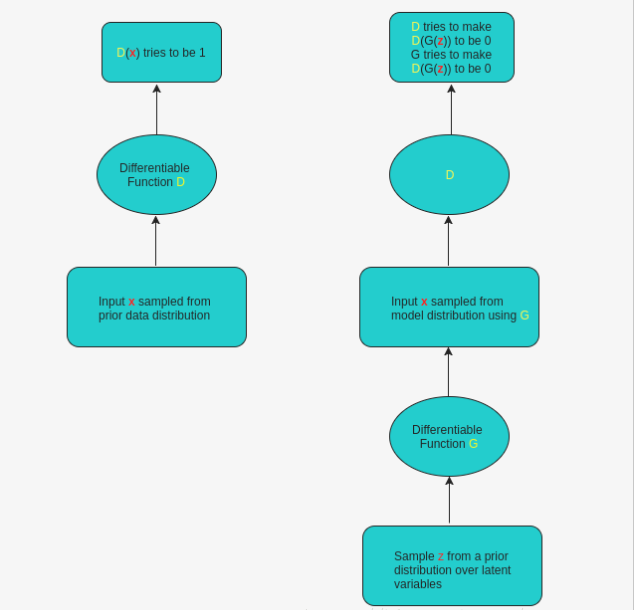

Suppose we have two networks, G (Generator) and D (Discriminator). In the training process, the goal of the generator network G is to try to generate real images to deceive the discriminator network D. The goal of D is to try to separate the images generated by G from the real ones. In this way, G and D form a dynamic "game process".

This principle can be expressed in the following equation:

Suppose we have a training set $S={x(1),... ,x(m)}$. Moreover, given any probability density function $pz(z)$ (of course, the simpler the corresponding probability distribution is, the better, while keeping the model complexity), we can use the random variable $Z∼pz(z)$ to sample $m$ noisy samples ${z(1),...,z(m)}$. ,z(m)}$. From this, we can obtain the likelihood function:

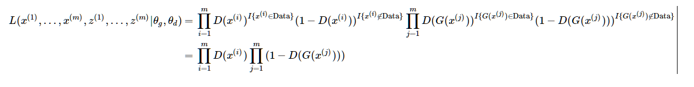

Further, the log-likelihood is obtained as:

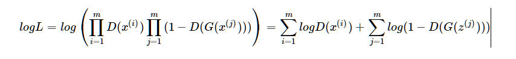

By the law of large numbers, when $m → ∞$, we approximate the expected loss by the empirical loss and obtain:

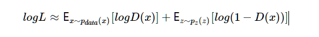

We want to optimize the learnable parameters of the discriminator to maximize the log-likelihood function on the one hand, and we want to optimize the learnable parameters of the discriminator to minimize the log-likelihood function on the other hand. Formalizing this yields our optimization objective:

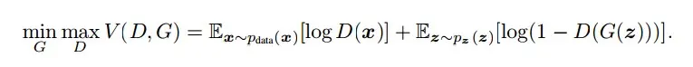

- The whole equation consists of two terms. x denotes the real picture, z denotes the noise input to the G network, and G(z) denotes the picture generated by the G network.
- D(x) represents the probability of the D network to determine whether **the real picture is real** (since x is the real one, the closer this value is to 1 for D, the better). And D(G(z)) is the probability of **D network to determine whether the G-generated picture is true or not. **
- G's purpose: as mentioned above, D(G(z)) is the probability** of the D network to determine whether the image generated by G is real or not. That is, G wants D(G(z)) to be as large as possible, when V(D, G) will be small. Thus we see that the top notation of the equation is min_G.
- The purpose of D: the more capable D is, the larger D(x) should be and the smaller D(G(x)) should be. At this point V(D,G) will become larger. Therefore the equation is for D to find the maximum (max_D)

We use here the stochastic gradient descent method to train D and G. The algorithm is as follows:

In the first step we train D. D is hoping that V(G, D) is as large as possible, so it is adding the gradient (ascending). In the second step we train G, V(G, D) is as small as possible, so the gradient is subtracted (descending). The whole training process is alternated.

### 3.2 DCGAN

DCGAN is a combination of CNN and GAN. It introduces the convolutional network into the generative model to do unsupervised training, and uses the powerful feature extraction ability of convolutional network to improve the learning effect of generative network.

The principle of DCGAN is the same as that of GAN, except that the G and D of GAN are replaced by two convolutional neural networks (CNNs), and DCGAN makes some changes to the structure of convolutional neural networks to improve the quality of samples and the speed of convergence:

- All pooling layers are eliminated. transposed convolutional layer is used for upsampling in the G network, and pooling is replaced by adding stride convolution in the D network.
- Batch normalization is used in both D and G.
- Remove the FC layer to turn the network into a fully convolutional network
- ReLU is used as the activation function in the G network, and tanh is used in the last layer.
- LeakyReLU is used as the activation function in the D network.

Schematic representation of the G network in DCGAN:

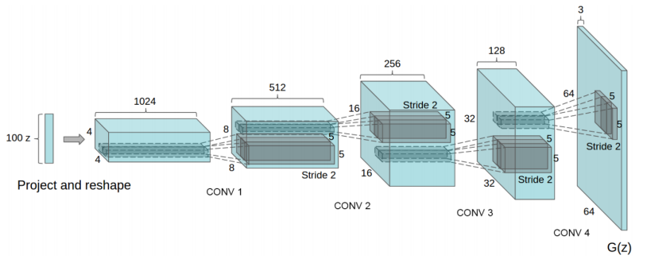

As can be seen, the input of the generator is a 100-dimensional noise, and the middle will pass through 4 convolution layers, with each convolution layer halving the number of channels and doubling the length and width to produce a 64*64*3 size image output. It should be noted that in many papers citing DCGAN, it is mistakenly thought that these 4 convolutional layers are **Wide Convolution**, but in fact, in the introduction of DCGAN, these 4 convolutional layers are **Fractionally Strided Convolution**, and the difference between the two is As shown in the figure below:

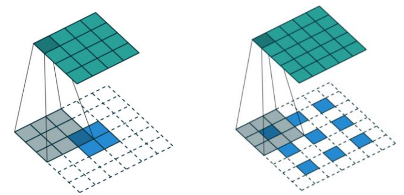

The difference between the two is that wide convolution adds zeros around the entire input matrix, while micro-step amplitude convolution splits the input matrix and adds zeros around each pixel point.

The above two **convolutional** operations that map from low-dimensional features to high-dimensional features are called **transpose convolution**, also known as deconvolution.

### 3.3 VAE

The variational self-encoder can be used to model a priori data distributions. It consists of two parts: an encoder and a decoder. The encoder maps high-level features of the data distribution to a low-level representation of the data, which is called a latent vector. The decoder absorbs the low-level representations of the data and then outputs the high-level representations of the same data.

.png)

#### 3.3.1 Variational Lower bound

The generated model is also generally modeled for optimization by maximizing the posterior probability. That is, using the Bayesian formulation:

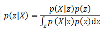

We want to replace the posterior probability $p(z|X)$ with the new function $q(z)$, then the two probability distributions need to be as similar as possible, and here the KL scatter is still chosen to measure the closeness of the two. According to the KL formula then we have:

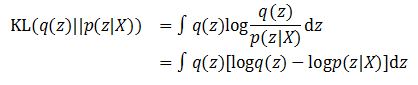

Transformation according to the Bayesian formula yields:

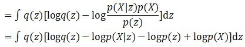

Since the objective of the integration is z, the items that are not related to z are then taken out of the integration notation to obtain:

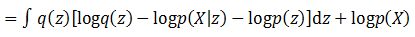

Swapping the equation left and right yields the following equation:

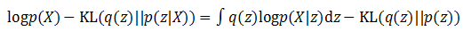

The goal of our training is to want KL(q(z)||p(z|X)) to be as small as possible, which is equivalent to making the right side of the equal sign as large as possible. The first term on the right side of the equal sign is actually based on the log-likelihood expectation of the probability of $q(z)$, and the second term is again a negative KL scatter, so we can assume that in order to find a good $q(z)$ that makes it as similar as possible to $p(z|X)$ and achieve the final optimization goal, the optimization objective will become:

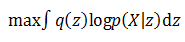

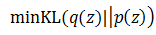

#### 3.3.2 Reparameterization Trick

The variational function $q(z)$, which, to approximate the posterior probability, actually represents the distribution of z given some X, would be $q(z|X)$ if its probability form were written in its entirety. We need to find a way to abstract it out of X. This conditional probability can be split into two parts, one is an observed variable $gϕ(X)$, which represents the deterministic part of the conditional probability and its value is similar to the expectation of a random variable; the other part is the random variable $ε$, which is responsible for the random part. If $z(i)=gϕ(X+ε(i))$, then $q(z(i))=p(ε(i))$, so the above formula on the derivation of the variance can be turned into the following one:

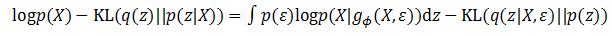

This assumption ϵ obeys a multidimensional and independent Gaussian distribution in each dimension. Also, the prior and posterior of z are assumed to be a multidimensional and independent Gaussian distribution in each dimension. The final form of the two optimization objectives is shown below.

#### 3.3.3 Encoder and Decoder formula

Our second optimization objective is to minimize the second term $KL(q(z)||p(z))$ on the right-hand side of Eq. Just now the prior of $z$ is assumed to be a multidimensional and independent Gaussian distribution in each dimension, and a stronger assumption can be given here that the mean of each dimension of this Gaussian distribution is 0 and the covariance is the unit matrix, then the previously mentioned KL scatter formula starts from:

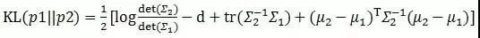

Simplified as:

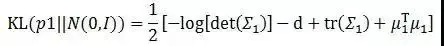

Instead of representing the covariance as the shape of a matrix in the actual calculation, a vector $σ1$ to represent the main diagonal of the covariance matrix is all that is needed, and the formula will be further simplified as follows:

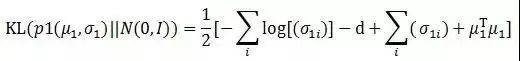

Since the function $gϕ()$ implements the transformation from the observed data to the implied data, this model is called the Encoder model.

The next optimization objective, which is to maximize the likelihood expectation of the first term on the left side of Equation. This part is relatively simple. Since the previous Encoder model has already calculated a batch of observed variables $X$ corresponding to the implied variables $z$, another deep model can be built here, modeled according to the likelihood, with the input being the implied variables $z$ and the output being the observed variables $X$. If the output image is similar to the previously generated image, then the likelihood is considered to be maximized. This model is called Decoder.

### 3.4 CVAE-GAN

The CVAE-GAN model combines the advantages of CVAE and GAN with better control, stability and diversity, and is a very effective generative model. Where C stands for the ability to generate images for a specified classification using the classification as input. It generates images quite well on each classification as shown in the following figure.

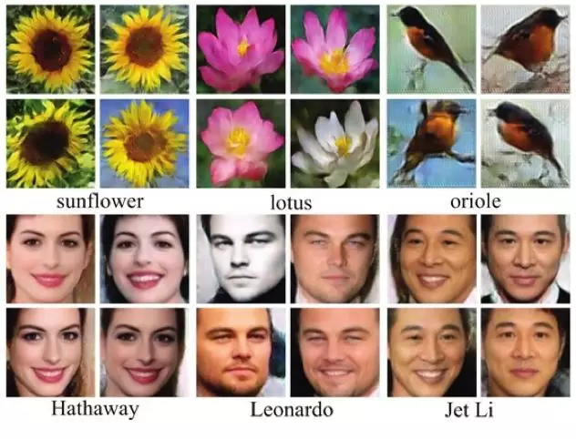

CVAE-GAN is mainly composed of the following 4 neural networks:

- E: Encoder (Encoder), input image x, output encoding z.
- G: Generator. Input encoding z, output image x.
- C: Classifier. Input image x, output category c.
- D: Discriminator. Input image x, determine its truthfulness.

The architecture of CVAE-GAN is shown in the following figure:

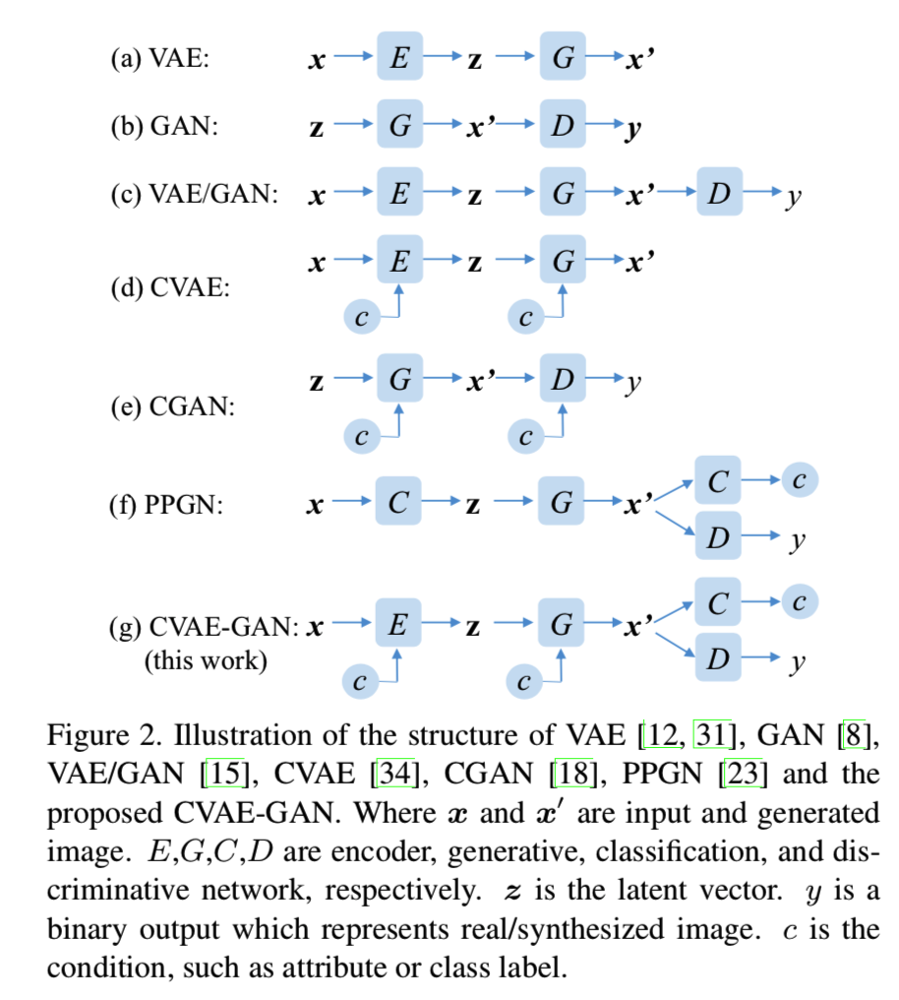

The G of VAE is better than the G of GAN, so the structure of VAE is in front. Then, since VAE's criterion for judging x' and x similarity is not good enough, we have to add D again to judge it. Finally, we need to ensure that the generated image belongs to the c-category, so C is also added.

where the Loss of G has three main parts: 

- For z generated from x, G should be able to restore x' close to x (pixel-wise close)
- The image generated by G should be identifiable by D as belonging to the real image
- the image generated by G should be identifiable by C as belonging to category c

The resulting z can be fairly well carved out of the image.

The detailed architecture of CVAE-GAN is shown in Fig:

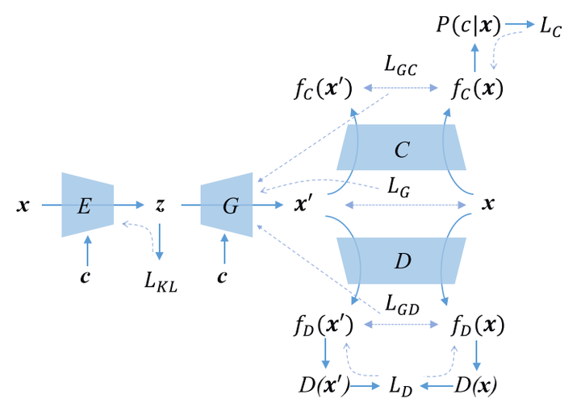

The training algorithm of CVAE-GAN is shown in the figure, where each item is intuitive. Note that there is also an important trick used in it, which is to expect x' and x to have similar features in the middle layers of the network for D and C. This helps stabilize the network: x' and x' have similar features in the middle layers. This helps to stabilize the network:

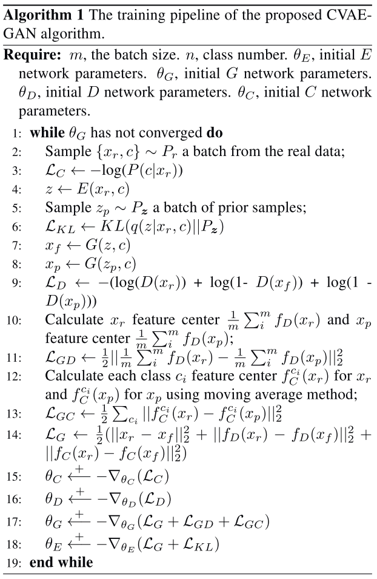

By using the four major networks E+G+C+D, CVAE-GAN achieves a fairly satisfactory generative model.

## 4 Results

In total, we tested GAN, DCGAN, VAE, CVAE-GAN on handwritten digital datasets and also extraordinarily used DCGAN on top of our own crawled anime dataset and got good results. All the experimental codes are implemented using Pytorch, and the initial size of our mnist dataset images is $28\times28$, and the initial size of anime images is $256\times256$.

Here are some specific experimental results to show and some of our hyperparameter choices.

### 4.1 GAN

**Hyper-parameters :**

latent_size = 64  

hidden_size = 256

image_size = 784

num_epochs = 200

batch_size = 100

lr = 0.0002

**Optimizer : adam optimizer**

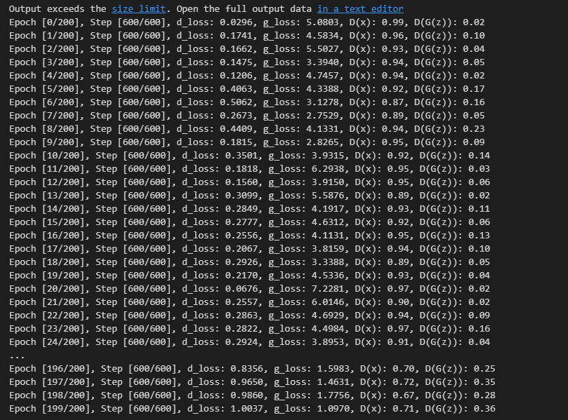

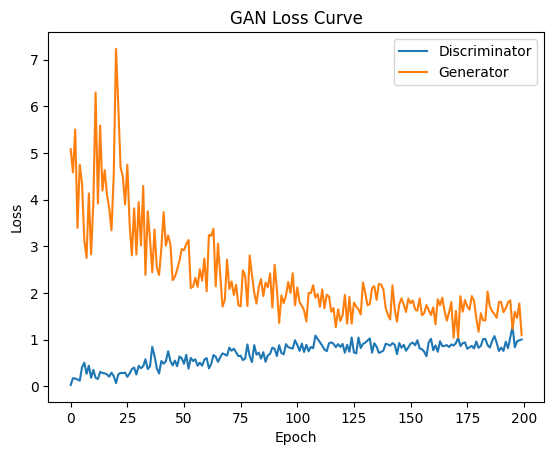

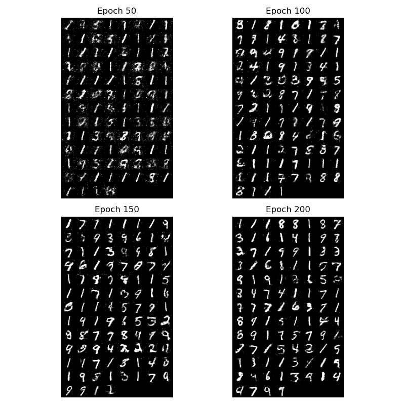

### 4.2 DCGAN

**Dataset: mnist**

**Hyper-parameters :**

batch_size = 128

num_epoch = 100

z_dimension = 100

lr = 0.0003

**Optimizer : adam optimizer**

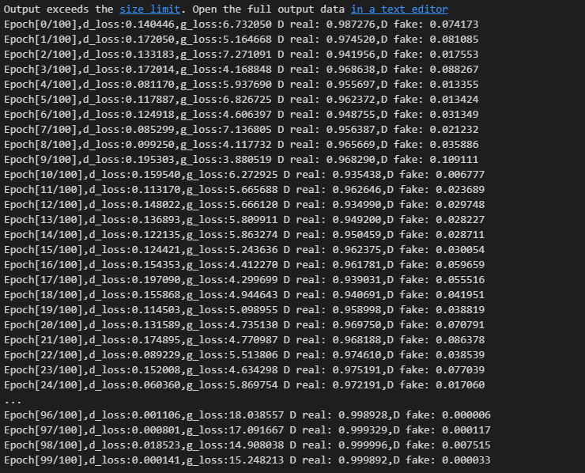

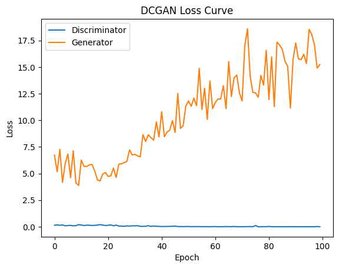

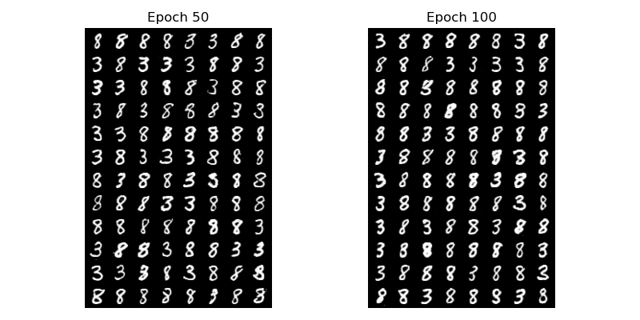

**Dataset: anime**

Random Seed:  999

workers = 2

batch_size = 128

image_size = 64

since images are RGB they have 3 channels: nc = 3

generator input size: nz = 100

generator's feature maps: ngf = 64

discriminator's feature maps: ndf = 64

num_epochs = 50

lr = 0.0002

beta1 = 0.5

**Optimizer : adam optimizer**

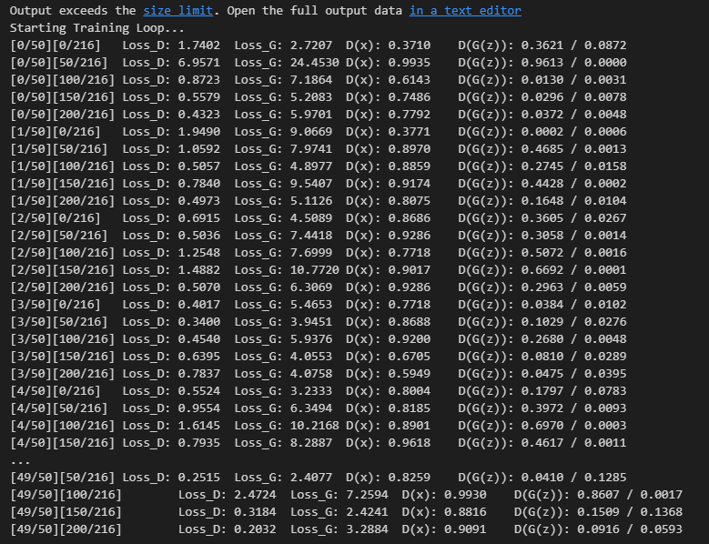

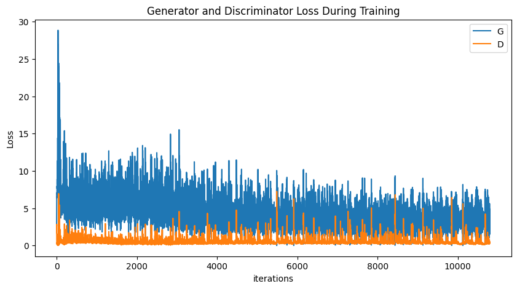

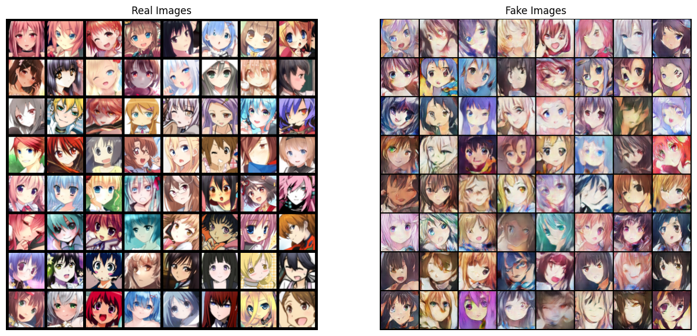

### 4.3 VAE

latent_dim = 2

input_dim = 28 * 28

inter_dim = 256

epochs = 200

batch_size = 128

lr = 0.0001

**Optimizer : adam optimizer**

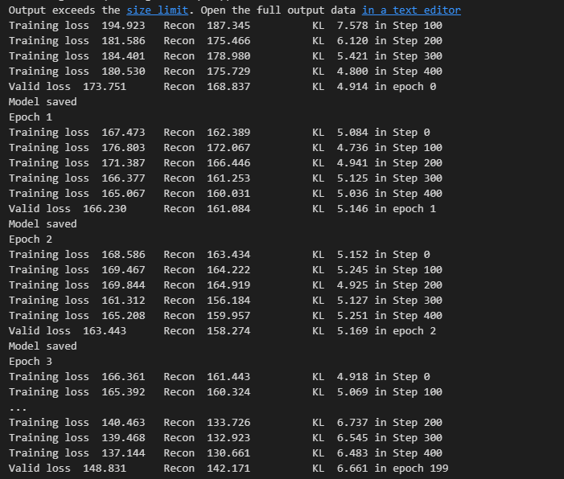

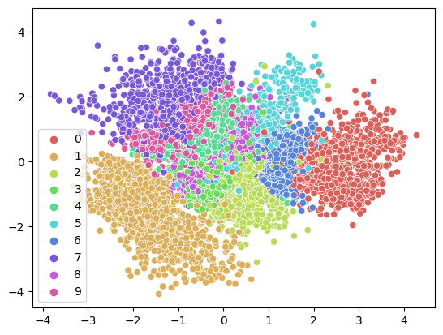

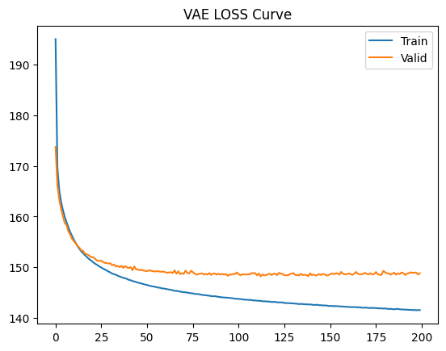

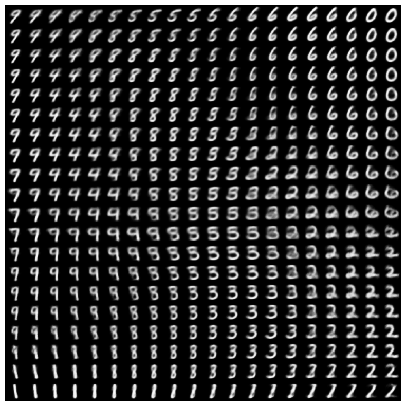

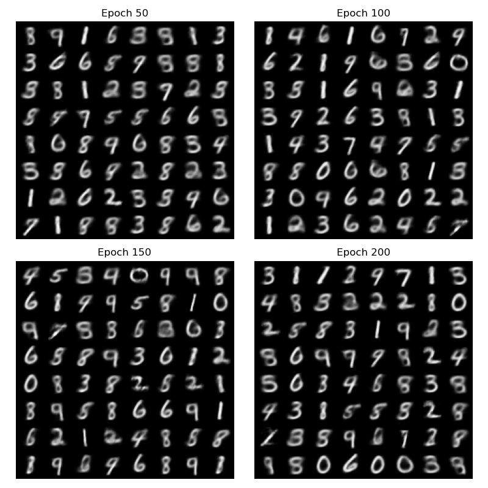

### 4.4 CVAE-GAN

batchSize = 128

imageSize = 28

nz = 100

nepoch = 200

Random Seed: 88

lr = 0.0001

**Optimizer : adam optimizer**

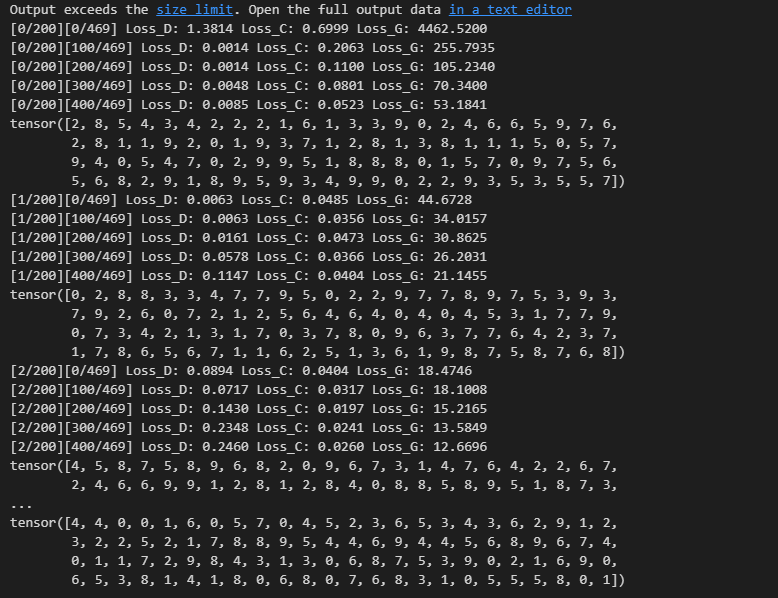

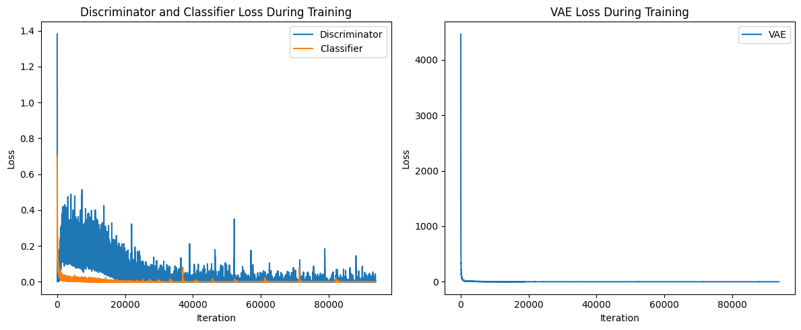

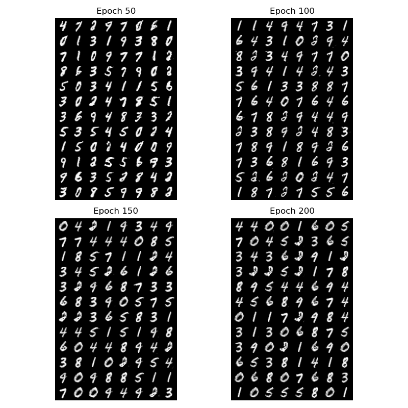

**Specify the generated image:**

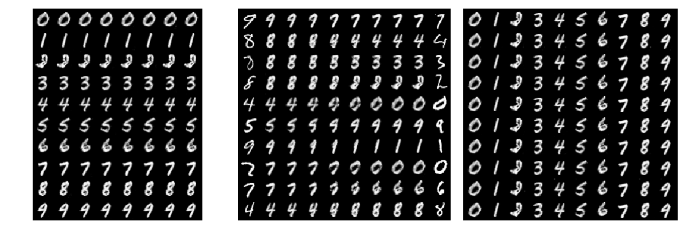

## 5 Conclusion

We evaluate and compare the performance of GAN, DCGAN, VAE, and CVAE-GAN on the MNIST dataset as well as on our own collection of anime face datasets. The results show that although GANs produce high-quality images that are visually similar to real images, they suffer from instability and pattern collapse problems during training. On the other hand, VAEs produce diverse images but with lower image quality. the DCGAN model shows better image quality and stability during training. the CVAE-GAN model combines the advantages of both models to produce high-quality images with controllable properties.

From the experimental results, we found that the DCGAN model outperforms the traditional GAN model in terms of image quality and training stability. The generated anime face images show high diversity and quality, which demonstrates the effectiveness of the DCGAN architecture in learning complex image features.

In addition, we observe that the VAE model is able to generate diverse images but with lower image quality compared to the GAN and DCGAN models. This is because the VAE model is optimized for reconstruction loss rather than for image generation. Nevertheless, the VAE model provides a useful tool to explore the latent space and generate new images from the learned distributions.

The CVAE-GAN model shows impressive results in generating high-quality images with controllable properties. By using the prior distribution learned by CVAE, we are able to control the image properties during image generation by GAN. This allows us to generate different styles of figures on the MNIST dataset and create smooth transitions between two different figures.

To achieve these results, we faced several challenges in the training process. A major issue is the instability of the GAN training process, which causes the model to produce low-quality images or collapse into a single pattern. To address this issue, we tried different modifications to the GAN architecture, such as DCGAN, and found that these modifications improved the stability of the training process.

Another challenge is to choose the appropriate hyperparameters for each model, such as learning rate and batch size. We performed a grid search to find the best values of these hyperparameters, which allowed us to achieve the best results for each model.

In addition, our anime face dataset is relatively small and contains a wide range of styles, which makes it difficult for us to achieve good image quality and diversity. We addressed this issue by pre-processing the images and using data enhancement techniques to increase the size of the dataset.

In summary, this project provides insights into the strengths and limitations of GAN, VAE and their hybrid models. We successfully applied these models to generate high-quality images on the MNIST dataset and our own anime face dataset. our experimental results demonstrate the potential of deep learning models in generating high-quality and diverse images. We also identified and overcame several challenges, including training instability and hyperparameter selection. Our results demonstrate the potential of these models in generating high quality and diverse images with controlled attributes.

## References

[1] Goodfellow, Ian, et al. "Generative adversarial networks." *Communications of the ACM* 63.11 (2020): 139-144.

[2] Arjovsky, Martin, Soumith Chintala, and Léon Bottou. "Wasserstein generative adversarial networks." *International conference on machine learning*. PMLR, 2017.

[3] Miyato, Takeru, et al. "Spectral normalization for generative adversarial networks." *arXiv preprint arXiv:1802.05957* (2018).

[4] Kingma, Diederik P., and Max Welling. "Auto-encoding variational bayes." *arXiv preprint arXiv:1312.6114* (2013).

[5] Higgins, Irina, et al. "beta-vae: Learning basic visual concepts with a constrained variational framework." *International conference on learning representations*. 2017.

[6] Larsen, Anders Boesen Lindbo, et al. "Autoencoding beyond pixels using a learned similarity metric." *International conference on machine learning*. PMLR, 2016.

[7] Wu, Jiajun, et al. "Learning a probabilistic latent space of object shapes via 3d generative-adversarial modeling." *Advances in neural information processing systems* 29 (2016).

[8] Makhzani, Alireza, et al. "Adversarial autoencoders." *arXiv preprint arXiv:1511.05644* (2015).

[9] Mescheder, Lars, Sebastian Nowozin, and Andreas Geiger. "Adversarial variational bayes: Unifying variational autoencoders and generative adversarial networks." *International conference on machine learning*. PMLR, 2017.

[10] Bao, Jianmin, et al. "CVAE-GAN: fine-grained image generation through asymmetric training." *Proceedings of the IEEE international conference on computer vision*. 2017.

